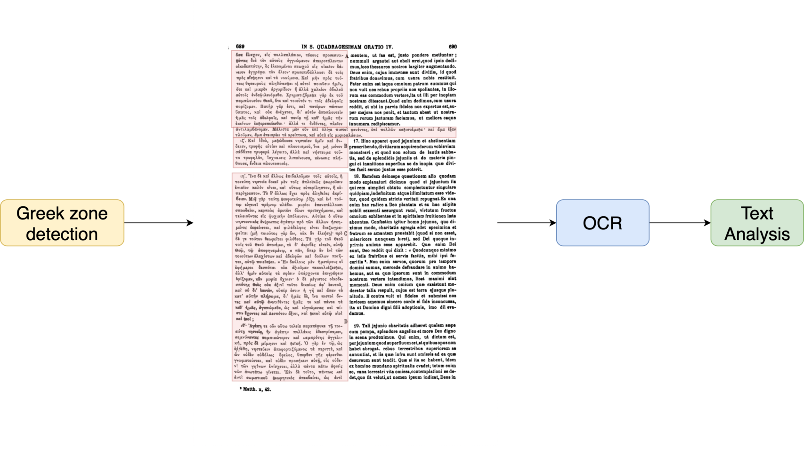

# Patrologia-Graeca

[](https://arxiv.org/abs/2603.09470)
[](https://zenodo.org/records/19915273)
[](https://zenodo.org/records/20008699)
[](https://creativecommons.org/licenses/by/4.0/)


The CGPG project (Calfa GRE*g*ORI Patrologia Graeca), led by Jean-Marie Auwers (UCLouvain), aims to OCRize the remaining non-digital versions of the Patrologia Graeca volumes. The project relies on the expertise of [GRE*g*ORI](https://www.gregoriproject.com) and [Calfa](https://calfa.fr).

[Webpage of the project](https://www.uclouvain.be/fr/instituts-recherche/incal/ciol/calfa-gregori-patrologia-graeca)

## Modus operandi

The project implements the creation of specialized OCR models for the automatic reading of heavily damaged Patrologia Graeca fonts and for the extraction of Greek content only. The texts produced are then tagged (lemmatization, POS, and morphology). This Github offers the raw data produced. A proofread version of each text will gradually be offered within the GRE*g*ORI interfaces.

<p style="text-align:center;">

</p>

## Works and Authors Dataset

| PG | Dates | Authors and Works | Edition PDF | Word Count |
|----|-------|-------------------|-------------|------------|
| 3 | Pre-Nicaean | Dionysius the Areopagite (vol. 1) | [PG003_ed.pdf](http://books.google.com/books?id=ALfUAAAAMAAJ) | 134,866 |
| 5 | Pre-Nicaean | Ignatius, Polycarp, Popes of 2nd c., Melito, others | [PG005_ed.pdf](http://books.google.com/books?id=PIQe9iqBoeQC) | 46,164 |
| 6 | Pre-Nicaean | Justin, Tatian, Athenagoras, Theophilus, Hermias | [PG006_ed.pdf](http://books.google.com/books?id=NZLYAAAAMAAJ) | 170,482 |
| 8 | Pre-Nicaean | Clement of Alexandria (vol. 1); Cohortatio, Paedagogus, Stromata | [PG008_ed.pdf](http://books.google.com/books?id=BwcRAAAAYAAJ) | 168,277 |
| 9 | Pre-Nicaean | Clement of Alexandria (vol. 2); Stromata, Quis dives, Excerpta, Eclogae, old scholia, diss. by Le Nourry | [PG009_ed.pdf](http://books.google.com/books?id=QAgRAAAAYAAJ) | 82,135 |
| 16.3 | Pre-Nicaean | Origen (vol. 6.3); Hexapla (contd); Hippolytus, Philosophumena | [PG016.3_ed.pdf](http://books.google.com/books?id=mAsRAAAAYAAJ) | 60,921 |
| 21 | 4th century | Eusebius (vol. 3); Praeparatio Evangelica | [PG021_ed.pdf](http://books.google.com/books?id=BwcRAAAAYAAJ) | 236,625 |
| 42 | 4th century | Epiphanius (vol. 2); Panarion (contd), Expositio fidei, Anacephalaeosis; Appendix: dissertations | [PG042_ed.pdf](http://books.google.com/books?id=QYHYAAAAMAAJ) | 161,237 |
| 67 | 5th century | Socrates, *Historia Ecclesiastica*; Sozomen, *Historia Ecclesiastica* | [PG067_ed.pdf](http://books.google.com/books?id=WivbHxo0L-sC) | 170,445 |
| 71 | 5th century | Cyril of Alexandria (vol. 4): Commentaries on Hosea, Joel, Amos, Jonah, Abdiah, Micaiah, Nahum, Habakuk, Haggai, etc. | [PG071_ed.pdf](https://books.google.be/books?id=worYAAAAMAAJ&redir_esc=y) | 210,957 |
| 73 | 5th century | Cyril of Alexandria (vol. 6): Commentary on John | [PG073_ed.pdf](http://books.google.com/books?id=ywsNQz1fTewC) | 191,303 |
| 87.1 | 7th century | Procopius of Gaza (vol. 1), Vetus Testamentum commentaries | [PG087.1_ed.pdf](http://books.google.com/books?id=CMcUAAAAQAAJ) | 151,167 |
| 101 | 9th century | Photius (vol. 1): Exegetica: Quaestiones Amphilochiana, Commentary on Novum Testamentum | [PG101_ed.pdf](http://books.google.com/books?id=VZfYAAAAMAAJ) | 178,850 |
| 107 | 10th century | Leo the Emperor: Theologica: 19 homilies and panegyrics, Letter to Omar, king of the Saracens, Juridical and canonical works; Poems, Apologia, Epigrams, Tactica sive de re militaria, oracula | [PG107_ed.pdf](http://books.google.com/books?id=Ru4GAAAAQAAJ) | 196,727 |
| 109 | 10th century | Historical works: continuation of Theophanes; Constantine Porphyrogenitus, *De vita Basilii Macedonis*; John Cameniates, *Narratio de excidio Thessalonicae*; Symeon Magister et Logothetes, *Annales*; Josephus Genesius, *History of Constantinople*; and others | [PG109_ed.pdf](http://books.google.com/books?id=Z0naYVT0w-EC) | 148,584 |
| 112 | 10th century | Constantine Porphyrogenitus (vol. 1): *De ceremoniis* | [PG112_ed.pdf](http://books.google.com/books?id=nyNKAAAAcAAJ) | 129,556 |
| 113 | 10th century | Constantine Porphyrogenitus (vol. 2): *De thematibus*, *De administrando imperio*, *Vita Basilii Macedonis*; Theodosius Diaconus, *De expugnatione Cretae*; and others | [PG113_ed.pdf](http://books.google.com/books?id=Z_QUAAAAQAAJ) | 104,371 |
| 118 | 10th century | Oecumenius (vol. 1): Commentary on Acts, Commentary on Paul's letters, Commentary on the Catholic letters | [PG118_ed.pdf](http://books.google.com/books?id=j_QUAAAAQAAJ) | 208,448 |
| 121 | 11th century | George Cedrenus (vol. 1): *Compendium Historiarum* | [PG121_ed.pdf](http://books.google.com/books?id=PIQe9iqBoeQC) | 160,853 |
| 122 | 11th century | George Cedrenus (vol. 2): *Compendium Historiarum* (contd); John Scylitzes, *Breviarium historicum*; Michael Psellus, many works | [PG122_ed.pdf](http://www.archive.org/details/patrologiaecurs61migngoog) | 150,647 |
| 123 | 11th century | Theophylact of Bulgaria (vol. 1): *Ennaratio in Evangelium Matthaei / Marci / Lucae / Joannis* | [PG123_ed.pdf](http://books.google.com/books?id=-SFJAAAAcAAJ) | 208,024 |
| 124 | 11th century | Theophylact of Bulgaria (vol. 2): *Commentarius in Joannis Evangelium* (contd); Commentary on Paul's letters | [PG124_ed.pdf](http://books.google.com/books?id=AccUAAAAQAAJ) | 210,302 |
| 125 | 11th century | Theophylact of Bulgaria (vol. 3): Commentary on Paul's letters (contd); 1 and 2 Peter; alternative versions of commentaries | [PG125_ed.pdf](http://books.google.com/books?id=Z7_UAAAAMAAJ) | 172,696 |
| 126 | 11th century | Theophylact of Bulgaria (vol. 4): More Novum Testamentum commentaries; Orations, Letters, Commentaries on minor prophets | [PG126_ed.pdf](http://books.google.com/books?id=eTYRAAAAYAAJ) | 164,706 |
| 134 | 12th century | John Zonaras (vol. 1): *Annales* | [PG134_ed.pdf](http://books.google.com/books?id=DrvUAAAAMAAJ) | 196,859 |
| 139 | 13th century | Isidore of Thessalonica, Sermons; Nicetas Maroneae; John of Citrus; Joel Chronographus, *Chronologia compendiaria*; Nicetas Choniates, *Historia Byzantina* (from John Comnenus to 1204), *Thesaurus* (books 1–5) | [PG139_ed.pdf](http://books.google.com/books?id=lscUAAAAQAAJ) | 134,703 |
| 146 | 14th century | Nicephorus Callistus (vol. 2): *Ecclesiastical History*, books 8–14 | [PG146_ed.pdf](http://books.google.com/books?id=xCJKAAAAcAAJ) | 156,848 |
| 148 | 14th century | Nicephorus Gregoras (vol. 1): *Historia Byzantina*, books 1–24 | [PG148_ed.pdf](http://books.google.com/books?id=IlWwi1vmdb4C) | 234,855 |
| 151 | 14th century | Gregory Palamas (vol. 2); Gregory Acindynus, Barlaam | [PG151_ed.pdf](http://books.google.com/books?id=PyNKAAAAcAAJ) | 399,518 |
| 153 | 14th century | John Cantacuzene (vol. 1): *Historia Byzantina* in 4 books (events from 1320–1354) | [PG153_ed.pdf](http://books.google.com/books?id=dIrYAAAAMAAJ) | 230,239 |
| 155 | 15th century | Simeon of Thessalonica (1430 AD) | [PG155_ed.pdf](http://books.google.com/books?id=_McUAAAAQAAJ) | 175,482 |
| 157 | 15th century | George Codinus (1400–1462): works about Constantinople, *De sepulchris imperatorem*; Ducas, *Historia Byzantina* 1341–1462, *Chronicon breve* (contd to 1523) | [PG157_ed.pdf](http://books.google.com/books?id=YB8RAAAAYAAJ) | 95,020 |
| 158 | 15th century | Michael Glyca (1448–1453): *Annals*, Letters; Others | [PG158_ed.pdf](http://books.google.com/books?id=hBIT95lCqEsC) | 163,148 |

## File formats description

This repository only contains the aligned OCR output. Each txt file contains the following markups:
$0 for volume number
$8 for page number (from the PDF)
$9 for the starting line

Files with **linguistic tags** (lemma, POS) are available on [Zenodo](https://zenodo.org/records/15780625).

## Ground-truth

Two training datasets have been released on Zenodo in 2022 and in 2026 : [https://zenodo.org/records/20008699](https://zenodo.org/records/20008699).

```latex
@dataset{vidal_gorene_2022_7296539,
  author       = {Vidal-Gorène, Chahan and
                  Kindt, Bastien},
  title        = {Patrologia Graeca (OCR ground truth)},
  month        = nov,
  year         = 2022,
  publisher    = {Zenodo},
  version      = {1.0.0},
  doi          = {10.5281/zenodo.7296539},
  url          = {https://doi.org/10.5281/zenodo.7296539}
}
```

## Bibliography

### To cite this work

Accepted to main track of LREC 2026
```latex
@article{vidal2026patrologia,
  title={The Patrologia Graeca Corpus: OCR, Annotation, and Open Release of Noisy Nineteenth-Century Polytonic Greek Editions},
  author={Vidal-Gor{\`e}ne, Chahan and Kindt, Bastien},
  journal={arXiv preprint arXiv:2603.09470},
  year={2026}
}
```


#### About guidelines for transcription and experimentations

```latex
@article{vidalgorene:hal-03982432,
  TITLE = {{La reconnaissance automatique d'écriture à l'épreuve des langues peu dotées}},
  AUTHOR = {{Vidal-Gorène, Chahan}},
  URL = {https://enc.hal.science/hal-03982432},
  JOURNAL = {{The Programming Historian en français}},
  NUMBER = {5},
  YEAR = {2023},
  DOI = {10.46430/phfr0023},
}
```

```latex
@article{vidalgorene:hal-04565386,
  TITLE = {{Reconhecimento autom{\'a}tico de manuscritos para o teste de idiomas n{\~a}o latinos}},
  AUTHOR = {{Vidal-Gorène, Chahan and Paulino, Joana}},
  URL = {https://hal.science/hal-04565386},
  JOURNAL = {{Programming Historian em portugu{\^e}s}},
  NUMBER = {4},
  YEAR = {2024},
  DOI = {10.46430/phpt0046},
}
```

### Related publications

```latex
@inproceedings{vidal2026under,
  title={Under-resourced studies of under-resourced languages: lemmatization and POS-tagging with LLM annotators for historical Armenian, Georgian, Greek and Syriac},
  author={Vidal-Gor{\`e}ne, Chahan and Kindt, Bastien and Cafiero, Florian},
  booktitle={Proceedings of the Second Workshop on Language Models for Low-Resource Languages (LoResLM 2026)},
  pages={324--334},
  year={2026}
}
```

```latex
@article{kindt2024fondation,
  author    = {Kindt, B. and Auwers, J.-M.},
  title     = {La Fondation Sedes Sapientiae soutient le projet de valorisation numérique de la Patrologie Grecque},
  journal   = {Bulletin de la Fondation Sedes Sapientiae},
  volume    = {45},
  month     = {janvier},
  year      = {2024},
  pages     = {19--21}
}
```

```latex
@article{kindt2022analyse,
  title={Analyse automatique du grec ancien par r{\'e}seau de neurones. {\'E}valuation sur le corpus De Thessalonica Capta},
  author={Kindt, Bastien and Vidal-Gor{\`e}ne, Chahan and Delle Donne, Saulo},
  journal={Bulletin de l’Acad{\'e}mie Belge pour l’{\'E}tude des Langues Anciennes et Orientales},
  pages={537--562},
  year={2022}
}
```

```latex
@article{kindt2022manuscript,
  title={From Manuscript to Tagged Corpora, An Automated Process for Ancient Armenian or Other Under-Resourced Languages of the Christian East},
  author={Kindt, Bastien and Vidal-Gor{\`e}ne, Chahan},
  journal={Armeniaca-International Journal of Armenian Studies},
  volume={1},
  pages={73--96},
  year={2022}
}
```

## Acknowledgements

- ASBL Byzantion
- [Calfa (Paris)](https://calfa.fr/)
- [UCLouvain - CIOL - Centre d'études orientales (CIOL, UCLouvain)](https://uclouvain.be/fr/instituts-recherche/incal/ciol)
- [UCLouvain - FSS - Fondation Sedes Sapientiae](https://acg-bxl.be/portfolio-item/uclouvain-fondation-sapientiae/)
- [UCLouvain - GREgORI Project](https://www.uclouvain.be/fr/instituts-recherche/incal/ciol/gregori-project)
- [UCLouvain - INCAL - Institut des Civilisations Arts et Lettres](https://www.uclouvain.be/fr/instituts-recherche/incal)
- [UCLouvain - RSCS - Institut de recherche pluridisciplinaire Religions Spiritualités Cultures Sociétés](https://www.uclouvain.be/fr/instituts-recherche/rscs)
- And generous donor who wishes to remain anonymous